# How to create option sets via CLI

- [How to create option sets via CLI](#how-to-create-option-sets-via-cli)
  - [Getting Started](#getting-started)
    - [Node.js](#nodejs)
    - [Node Package Manager (npm)](#node-package-manager-npm)
  - [Command Line Interface Tools (CLI)](#command-line-interface-tools-cli)
    - [Installation](#installation)
    - [Logging in using Identity CLI](#logging-in-using-identity-cli)
  - [API Hosting](#api-hosting)
  - [Project Structure](#project-structure)
  - [Making Changes](#making-changes)
  - [Configuring Options Sets](#configuring-options-sets)
  - [Using Options Sets](#using-options-sets)
  - [Handy Hint](#handy-hint)
  - [Finishing Notes](#finishing-notes)

## Getting Started

Before using the Command Line Interface (CLI) Tools, you will first need to download and install Node.js and npm on your local machine.

### Node.js

You can download Node.js here: https://nodejs.org/en/download/

To check if you have Node.js installed, run this command in your terminal:

```
node -v
```

### Node Package Manager (npm)

npm is installed with Node.js

npm is distributed with Node.js - which means that when you download Node.js, you automatically get npm installed on your computer.

To confirm that you have npm installed you can run this command in your terminal:

```
npm -v
```

## Command Line Interface Tools (CLI)

### Installation

To install the CLI tools, open a terminal (On Windows, this can be `cmd.exe` and on MacOS, this can be the `Terminal.app`) and type in the following command:

```
npm install -g @blinkmobile/cli @blinkmobile/identity-cli @blinkmobile/server-cli
```

**Note: if you are using Windows, you might have to close your terminal (`cmd.exe`) and open it up again for the changes to take effect.**

### Logging in using Identity CLI

Now that you have `identity-cli` installed, you can go back to the terminal and type in:

```
bm identity login
```

A browser window will open and you'll be able to select your identity provider. Usually this would be your work Gmail/Gsuite account (click the login with Google button). If not, just login with your OneBlink username and password.

<center>

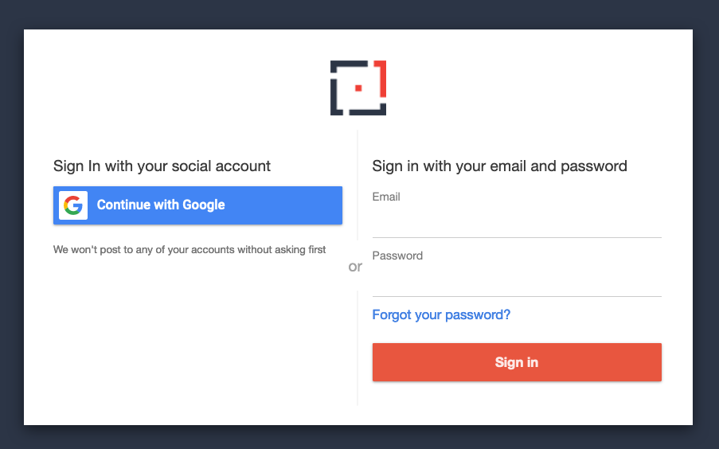

</center>

Once you log in, you will be provided with a code to copy and paste into your terminal.

<center>

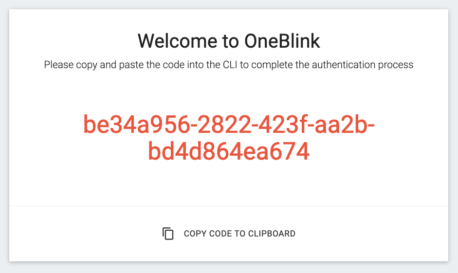

</center>

This will authenticate you, and you will now be logged in.

## API Hosting

To host an API in the OneBlink Console, navigate to the `API Hosting` section, found on the left side menu:

<center>

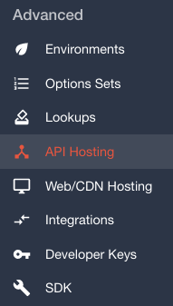

</center>

To configure a new API, click the orange button on the bottom right.

You will be asked to type in a name for your API subdomain — you can call it whatever you want.

<center>

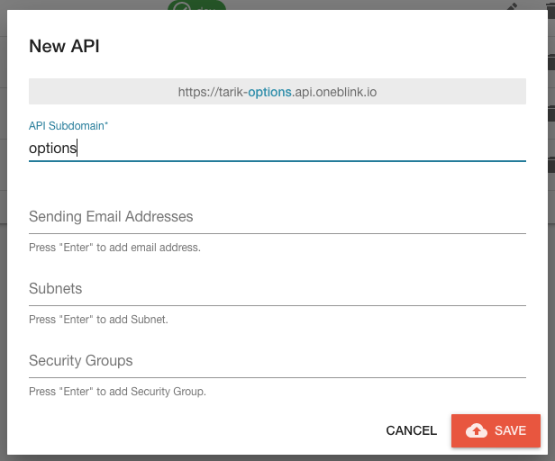

</center>

**Note: You can ignore all the other fields - you just need a name for your API.**

## Project Structure

For this guide, I’ve created a folder with 3 option sets to use as an example - You can download or clone it [here](https://github.com/tikeyike/option-sets).

<center>

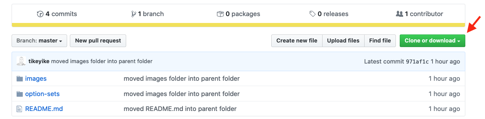

</center>

Once you have cloned/downloaded and exacted the file, now you should have a folder called 📁 `option-sets` with 3 sub-folders, and in each folder there is an index.js file.

<center>

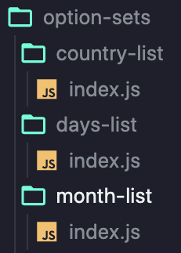

</center>

**Note: the folder structure inside the 📁 `option-sets` folder has a specific structure/pattern.**

Now you want to open 📁 `option-sets` folder in your terminal, so it should look something like this (assuming the folder is located on your Desktop):

On Windows:

```
C:\Users\{YOUR USERNAME}\Desktop\option-sets>
```

On MacOS:

```
{YOUR COMPUTER NAME}:option-sets {YOUR USERNAME}$
```

**Note: the folder path will be different depending on where you saved the 📁 `option-sets` folder**

Now type in:

```
npm init
```

You can just press enter and go through all the options without typing anything and type in yes when prompted.

This is going to create a 📄 `package.json` file in the `option-sets` folder.

Now type in:

```
bm server scope {YOUR API URL}
```

<center>

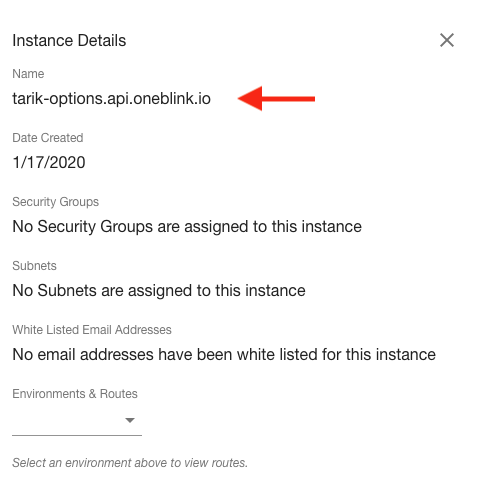

</center>

Note: You can find this API URL in the API Hosting section where you configured your new API previously. You can just copy and paste this URL into the terminal.

Running this command will create a new file on your current folder (`option-sets`) called 📄 `.blinkmrc.json`

Note: This file maybe be hidden - you would need to change your settings on your computer to show hidden files if you cannot find the 📄 `.blinkmrc.json` file.

Open up the `.blinkmrc.json` file and add in:

```
"cors": true,
```

So it should look something like this:

```json
{
  "server": {
    "project": "{YOUR API URL}",
    "region": "ap-southeast-2",
    "cors": true,
    "service": {
      "bucket": "server-cli-service-bundles-multitenant",
      "origin": "https://server-cli-service.blinkm.io"
    }
  }
}
```

Now you can go back to the terminal and type in:

```
bm server deploy
```

Then press `y`

This may take around 5 to 10 minutes to initialise since this is the first time you are deploying your project.

Future deployments (for this project) should only take about 10 to 20 seconds.

## Making Changes

If you make changes or add more option sets (following the same [folder/file structure](#project-structure)) - all you need to do is to [open `option-sets` folder in your terminal](#project-structure) again, and type in:

```
bm server deploy
```

And press `y`

## Configuring Options Sets

Once you have deployed your project, you now need to configure your option sets.

You can do this by going to the `Option Sets` section on the left menu and configuring a new option set by clicking the button on the bottom right.

<center>

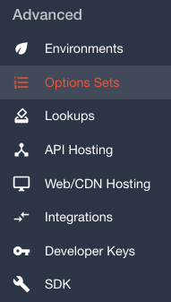

</center>

Since you are using a OneBlink hosted API, you need to select that option give it a name (which you can go back and edit at a later time).

<center>

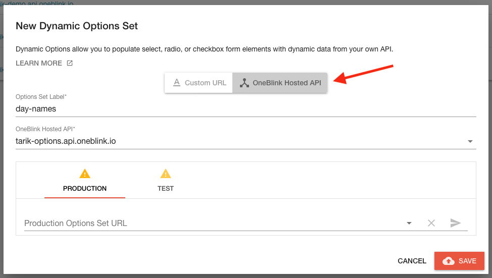

</center>

Now you have to select which API you want to use (in this case, the one you just deployed earlier on).

Once you select the API you want, now you have to configure it for the environments that you would like these option sets to appear in.

<center>

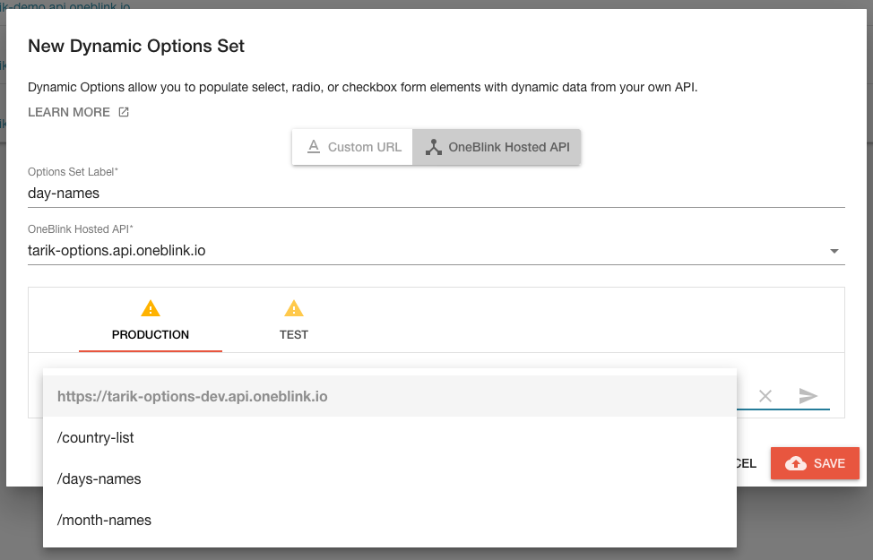

</center>

**Note: This is not the same as deploying projects to different API environments.**

Once you configure the option sets with the environments — you can now test to see if you options work by clicking the send button on the right:

<center>

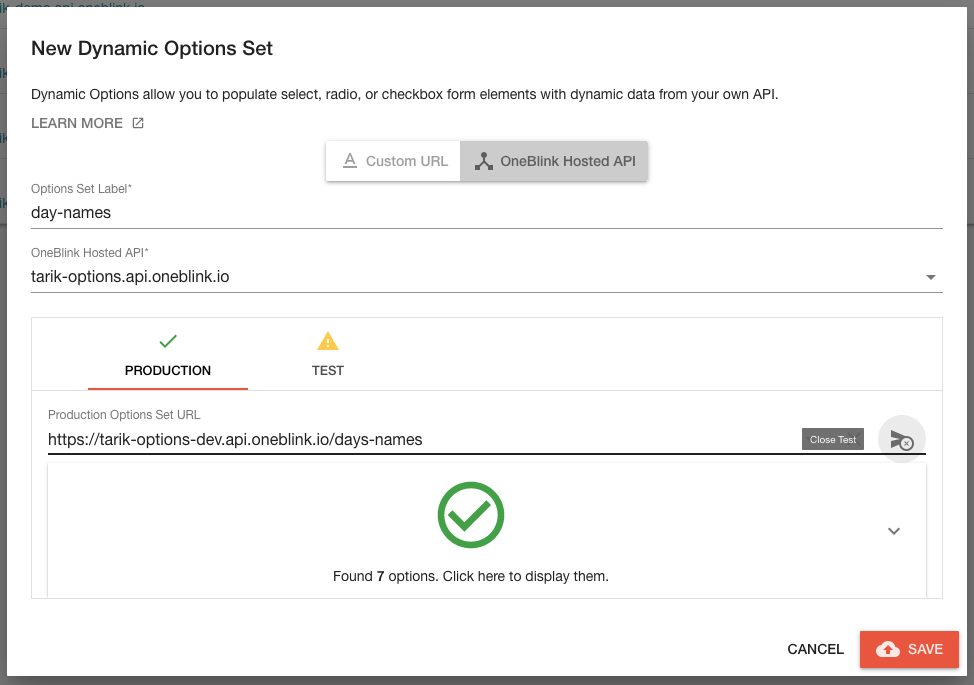

</center>

**Repeat this step if you would like to set up multiple option sets e.g. day names, month names, country names etc.**

## Using Options Sets

Now that you have deploy your option sets, you can now go into the form builder and choose either a radio button, checkbox, select or autocomplete.

<center>

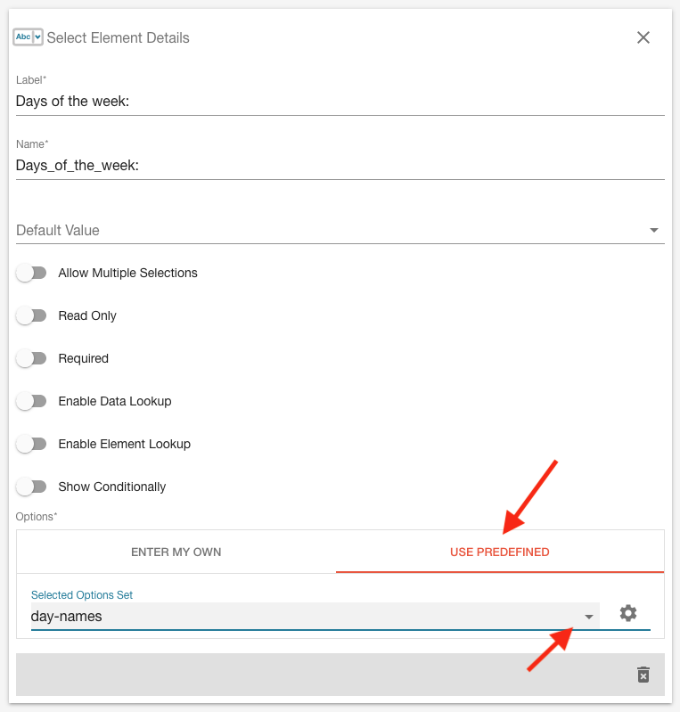

</center>

Click on `USE PREDEFINED` and use the dropdown below to select the option set you have just created.

## Handy Hint

If you would like to quickly format a list for your option sets - one way you can do this is by using a spreadsheet program such as Microsoft Excel or Google Sheets and use this formula to format your list:

```
="{ label: `"&A1&"`, value: `"&A1&"` },"
```

Lets say you have a table like this:

<center>

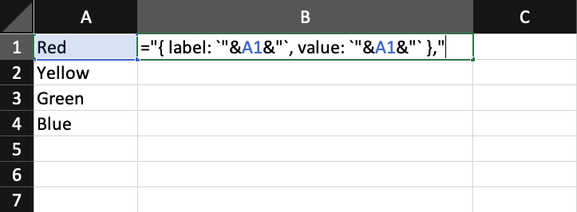

</center>

Paste the formula into B1 and press enter. Now hover over the bottom right of the cell and drag down.

<center>

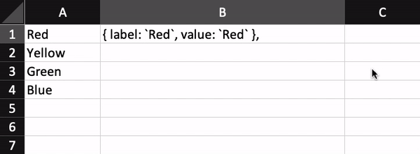

</center>

## Finishing Notes

If you have any issues while following this guide, please feel free to email support@oneblink.io, we're always happy to help.
